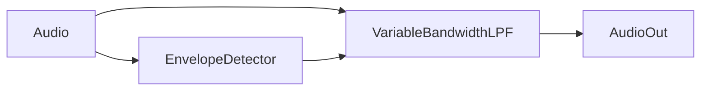

# autowah


## Installing

### Linux

You will need the port audio C library installed with header files, on Ubuntu 20.04 based distributions the following works:

```
sudo apt install portaudio19-dev
```

## Running 

```
poetry run autowah &; chrt -b --pid $!
```



### Todo

- [x] Cleanup Envelope Detector implementation
- [x] Implement variable bandwidth filter (needs to be computed per sample)
- [x] Cleanup the variable bw filter
- [X] Tuneable Q filter (IIR)
- [x] Fix the underruns based on the filter len... Or get a better tuneable Q filter in there...
- [x] Finish the autowah integration
- [x] control variables and interactive plot
- [ ] Fix exiting the program cleanly
- [ ] Migrate to a pyqtplot based UI
- [ ] Add a compression block
- [ ] Get CI working
- [ ] Clean up the scope code
- [ ] Abstract block type + wiring diagram concept?
- [ ] Create plots and gather resources
- [ ] Diagram out architecture of the system
- [ ] Write blog post
- [ ] Publish
- [ ] Record some videos
- [ ] Apply to a wav file
